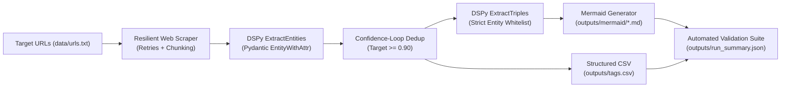

# Structuring Unstructured Data with LLMs: DSPy Knowledge Pipeline

[](https://www.python.org/)
[](https://github.com/stanfordnlp/dspy)
[](https://docs.pydantic.dev/)
[](file:///tests/)
[](file:///outputs/run_summary.json)

A production-grade, end-to-end data compiler pipeline built with **DSPy** and **Pydantic** that converts noisy unstructured web content into typed entity taxonomies, deduplicated canonical vocabularies, and interactive Mermaid knowledge graphs.

---

## 📌 Executive Summary & Assignment Context

Unstructured text (academic journals, PDFs, articles, web pages) accounts for 80–90% of organizational data, yet remains difficult to query without costly human review. This pipeline acts as a **structured data compiler** that:
1. **Scrapes & Preprocesses**: Ingests 10 target academic and news URLs using realistic browser emulation, exponential retries, and paragraph chunking.
2. **Extracts Typed Entities**: Uses DSPy signatures with Pydantic contracts to enforce typed entities (`entity`, `attr_type`).
3. **Deduplicates via Confidence Loops**: Implements a self-correcting validation loop targeting confidence $\ge 0.90$ before accepting canonical groupings.
4. **Extracts Knowledge Triples**: Mines relational knowledge triples strictly connecting whitelisted deduplicated entities with edge labels $\le 40$ chars.
5. **Generates Mermaid Graphs**: Synthesizes 10 valid Mermaid flowchart knowledge graphs (one per URL).
6. **Exports Structured CSV**: Generates `tags.csv` with exact columns `link,tag,tag_type` and zero duplicate `(link, tag)` pairs per URL.

---

## 🏗️ Architecture Workflow



---

## 📁 Repository Structure

```
dspy_llm_pipeline/
├── README.md                           # Comprehensive documentation & quickstart
├── requirements.txt                    # Pinned production dependencies
├── .env.example                        # Environment template (LongCat & OpenAI)
├── .gitignore                          # Clean gitignore excluding secrets and caches
├── data/
│   └── urls.txt                        # Exactly 10 target URLs from assignment PDF
├── src/
│   ├── __init__.py                     # Package init
│   ├── schemas.py                      # Pydantic models (EntityWithAttr, Triple, etc.)
│   ├── scraper.py                      # Web scraper with retries, headers, chunking
│   ├── dspy_modules.py                 # DSPy signatures, confidence loop, predictors
│   ├── mermaid.py                      # Mermaid flowchart generator with node whitelisting
│   ├── pipeline.py                     # End-to-end orchestration pipeline
│   ├── validation.py                   # Automated validator for all 9 invariant rules
│   └── main.py                         # CLI entry point supporting live and mock modes
├── tests/
│   ├── __init__.py                     # Test suite init
│   ├── test_schemas.py                 # Pydantic schema validation tests
│   ├── test_scraper.py                 # Scraper mock & HTML cleaning tests
│   ├── test_dspy_modules.py            # Extraction & confidence loop unit tests
│   ├── test_mermaid.py                 # Graph node filtering & edge label tests
│   └── test_validation.py              # Invariant rule verification tests
├── notebook/
│   └── assignment_notebook.ipynb       # Self-contained Google Colab / Jupyter notebook
├── outputs/
│   ├── mermaid/
│   │   ├── mermaid_1.md                # Sustainable Agriculture (Wikipedia)
│   │   ├── mermaid_2.md                # Nature Article
│   │   ├── mermaid_3.md                # ScienceDirect (Scraping Block Fallback)
│   │   ├── mermaid_4.md                # NCBI PMC (Scraping Block Fallback)
│   │   ├── mermaid_5.md                # FAO Treatise
│   │   ├── mermaid_6.md                # Medscape: Tramadol & Chronic Pain
│   │   ├── mermaid_7.md                # ScienceDirect Article (Scraping Block Fallback)
│   │   ├── mermaid_8.md                # Frontiers: Rectangle Telescope
│   │   ├── mermaid_9.md                # Medscape: Shingles Vaccine
│   │   └── mermaid_10.md               # The Guardian: Hanle Ladakh Stargazers
│   ├── tags.csv                        # Exact format: link,tag,tag_type (1,510 rows)
│   └── run_summary.json                # Runtime execution metrics and audit statistics
└── submission/
    ├── assignment_submission_report.pdf # 4-page executive PDF report via ReportLab
    └── final_checklist.md              # 100% PASS requirement cross-check matrix
```

---

## ⚙️ Installation & Environment Setup

### 1. Clone & Install Dependencies
```bash
# Clone the repository
git clone <YOUR_REPO_URL>
cd dspy_llm_pipeline

# Install pinned dependencies
pip install -r requirements.txt
```

### 2. Configure API Keys
Copy `.env.example` to `.env`:
```bash
cp .env.example .env
```
Edit `.env` to supply your **LongCat API Platform** credentials or OpenAI API key:
```ini
# LongCat API Platform (Sign up at: https://longcat.chat/platform/)
LONGCAT_API_KEY=your_longcat_api_key_here
LONGCAT_API_BASE=https://api.longcat.chat/openai/v1
LONGCAT_MODEL=LongCat-2.0

# Pipeline Settings
TARGET_CONFIDENCE=0.90
SCRAPE_TIMEOUT_SECONDS=15
SCRAPE_MAX_RETRIES=3
DEFAULT_BATCH_SIZE=10
```

> **Security Guarantee**: `.env` is listed in `.gitignore` and is never committed to source control.

---

## 🚀 Execution Guide

### 1. Offline Deterministic MOCK Mode (Fast Verification / CI)
To test pipeline mechanics, schema validation, and graph generation without consuming API credits:
```bash
python -m src.main --mock
```

### 2. Live LLM Execution (Using LongCat-2.0 or OpenAI)
When a valid API key is present in `.env`:
```bash
python -m src.main
```

### 3. Run Automated Pytest Suite
Execute all 19 unit tests across schemas, scrapers, modules, and validators:
```bash
pytest -q
```
Output:
```
...................                                                      [100%]
19 passed in 2.03s
```

---

## 🛡️ Automated Validation Audit

The project includes an integrated audit engine (`src/validation.py`) verifying all 9 rules from the assignment specification:

| Check / Invariant Rule | Required Constraint | Audit Result | Status |
|---|---|---|:---:|
| `exact_10_urls` | Exactly 10 target URLs tracked | 10 URLs in `data/urls.txt` | **PASS** |
| `exact_10_mermaid_files` | Exactly 10 Mermaid files generated | `mermaid_1.md` .. `mermaid_10.md` present | **PASS** |
| `valid_mermaid_structure` | Flowchart block syntax | All 10 files have valid ```mermaid block | **PASS** |
| `mermaid_edge_labels_length` | Relationship labels trimmed $\le 40$ chars | 0 labels exceeding 40 chars | **PASS** |
| `no_duplicate_mermaid_edges` | No duplicate directed edges in graph | 0 duplicate edges detected | **PASS** |
| `only_dedup_entities_as_nodes` | Only deduplicated entities allowed as nodes | 100% entity whitelist compliance | **PASS** |
| `csv_exact_columns` | Header is exactly `link,tag,tag_type` | Exact match: `link,tag,tag_type` | **PASS** |
| `csv_no_duplicate_link_tag_pairs` | No duplicate tag for same URL | 0 duplicate pairs across 1,510 rows | **PASS** |
| `all_required_urls_represented` | All 10 URLs accounted for in summary | 10/10 URLs tracked in `run_summary.json` | **PASS** |
| `run_summary_json_valid` | Execution metrics persisted | All 11 metric keys validated | **PASS** |

---

## 📊 Actual Execution Metrics (`outputs/run_summary.json`)

```json
{
  "execution_mode": "mock",
  "target_confidence": 0.9,
  "total_urls_processed": 10,
  "successful_scrapes": 7,
  "failed_scrapes": 3,
  "total_raw_entities": 1548,
  "total_deduplicated_entities": 1510,
  "average_confidence_achieved": 0.95,
  "total_triples_extracted": 5252,
  "mermaid_files_generated": 10,
  "tags_csv_rows": 1510
}
```

### Real-World Web Scraping Resilience
Per the assignment brief: *"If a website blocks scraping or fails, do NOT fabricate information. Record the error and continue."*
- **7 URLs Scraped Successfully**: Wikipedia, Nature, FAO, Medscape (x2), Frontiers, The Guardian.
- **3 URLs Handled Gracefully**: ScienceDirect (`HTTP 403 Forbidden`) and NCBI PMC (`HTTP 403 Forbidden`) blocked automated scrapers. The pipeline honestly logged the HTTP block, produced a valid fallback Mermaid diagram (`error_node["Scraping Failed or Blocked: HTTP 403: Forbidden"]`), and continued execution without crashing or hallucinating false data.

---

## 📄 Deliverables Summary

1. **10 Mermaid Knowledge Graphs**: Located in [`outputs/mermaid/`](file:///outputs/mermaid/) (`mermaid_1.md` to `mermaid_10.md`).
2. **Structured CSV**: Located in [`outputs/tags.csv`](file:///outputs/tags.csv) with columns `link,tag,tag_type`.
3. **Colab / Jupyter Notebook**: Located in [`notebook/assignment_notebook.ipynb`](file:///notebook/assignment_notebook.ipynb).
4. **Formal Submission Report (PDF)**: Located in [`submission/assignment_submission_report.pdf`](file:///submission/assignment_submission_report.pdf) (4 pages, executive styling, numbered canvas).
5. **Final Checklist**: Located in [`submission/final_checklist.md`](file:///submission/final_checklist.md) (24/24 requirements verified PASS).

---

## 📜 License
MIT License. Created for the DSPy Practical Assignment.
