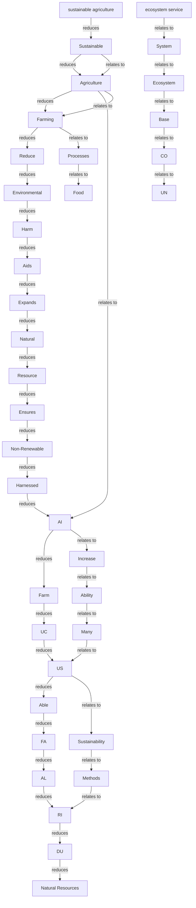

```mermaid
flowchart TD
    %% Knowledge Graph: Sustainable agriculture - Wikipedia
    %% Source: https://en.wikipedia.org/wiki/Sustainable_agriculture
    id_sustainable_agricult_ad41c2["sustainable agriculture"] -- "reduces" --> id_sustainable_49a31d["Sustainable"]
    id_sustainable_49a31d["Sustainable"] -- "reduces" --> id_agriculture_f8ea9e["Agriculture"]
    id_agriculture_f8ea9e["Agriculture"] -- "reduces" --> id_farming_1ac706["Farming"]
    id_farming_1ac706["Farming"] -- "reduces" --> id_reduce_a6d0c7["Reduce"]
    id_reduce_a6d0c7["Reduce"] -- "reduces" --> id_environmental_3bbfda["Environmental"]
    id_environmental_3bbfda["Environmental"] -- "reduces" --> id_harm_861854["Harm"]
    id_harm_861854["Harm"] -- "reduces" --> id_aids_4a8b9d["Aids"]
    id_aids_4a8b9d["Aids"] -- "reduces" --> id_expands_22577c["Expands"]
    id_expands_22577c["Expands"] -- "reduces" --> id_natural_8f4ef0["Natural"]
    id_natural_8f4ef0["Natural"] -- "reduces" --> id_resource_96ab4e["Resource"]
    id_resource_96ab4e["Resource"] -- "reduces" --> id_ensures_8e355c["Ensures"]
    id_ensures_8e355c["Ensures"] -- "reduces" --> id_non_renewable_fd7a9f["Non-Renewable"]
    id_non_renewable_fd7a9f["Non-Renewable"] -- "reduces" --> id_harnessed_5e6cdf["Harnessed"]
    id_harnessed_5e6cdf["Harnessed"] -- "reduces" --> id_ai_4921c0["AI"]
    id_ai_4921c0["AI"] -- "reduces" --> id_farm_e67ed9["Farm"]
    id_farm_e67ed9["Farm"] -- "reduces" --> id_uc_d38af0["UC"]
    id_uc_d38af0["UC"] -- "reduces" --> id_us_0b3b97["US"]
    id_us_0b3b97["US"] -- "reduces" --> id_able_c0db7d["Able"]
    id_able_c0db7d["Able"] -- "reduces" --> id_fa_89e6d2["FA"]
    id_fa_89e6d2["FA"] -- "reduces" --> id_al_97282b["AL"]
    id_al_97282b["AL"] -- "reduces" --> id_ri_08c7b0["RI"]
    id_ri_08c7b0["RI"] -- "reduces" --> id_du_13a014["DU"]
    id_du_13a014["DU"] -- "reduces" --> id_natural_resources_656114["Natural Resources"]
    id_ecosystem_service_93ea79["ecosystem service"] -- "relates to" --> id_system_54b530["System"]
    id_system_54b530["System"] -- "relates to" --> id_ecosystem_2ceb7c["Ecosystem"]
    id_ecosystem_2ceb7c["Ecosystem"] -- "relates to" --> id_base_593616["Base"]
    id_base_593616["Base"] -- "relates to" --> id_co_ab6c04["CO"]
    id_co_ab6c04["CO"] -- "relates to" --> id_un_067427["UN"]
    id_agriculture_f8ea9e["Agriculture"] -- "relates to" --> id_ai_4921c0["AI"]
    id_ai_4921c0["AI"] -- "relates to" --> id_increase_11198b["Increase"]
    id_increase_11198b["Increase"] -- "relates to" --> id_ability_424dbe["Ability"]
    id_ability_424dbe["Ability"] -- "relates to" --> id_many_8cd283["Many"]
    id_many_8cd283["Many"] -- "relates to" --> id_us_0b3b97["US"]
    id_us_0b3b97["US"] -- "relates to" --> id_sustainability_ab3b66["Sustainability"]
    id_sustainability_ab3b66["Sustainability"] -- "relates to" --> id_methods_a9ac5a["Methods"]
    id_methods_a9ac5a["Methods"] -- "relates to" --> id_ri_08c7b0["RI"]
    id_sustainable_49a31d["Sustainable"] -- "relates to" --> id_agriculture_f8ea9e["Agriculture"]
    id_agriculture_f8ea9e["Agriculture"] -- "relates to" --> id_farming_1ac706["Farming"]
    id_farming_1ac706["Farming"] -- "relates to" --> id_processes_530968["Processes"]
    id_processes_530968["Processes"] -- "relates to" --> id_food_62506b["Food"]
```