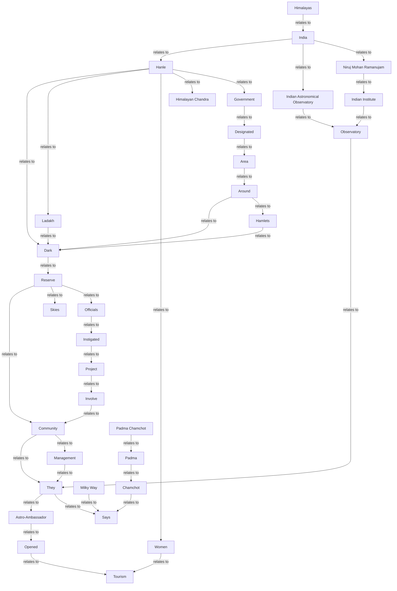

```mermaid
flowchart TD
    %% Knowledge Graph: ‘The universe has opened up for us’: meet the astro-ambassadors who welcome stargazers to the Himalayas | Global development | The Guardian
    %% Source: https://www.theguardian.com/global-development/2025/oct/13/astro-ambassadors-stargazers-himalayas-hanle-ladakh-india
    id_himalayas_be30a6["Himalayas"] -- "relates to" --> id_india_11a983["India"]
    id_india_11a983["India"] -- "relates to" --> id_hanle_69391f["Hanle"]
    id_hanle_69391f["Hanle"] -- "relates to" --> id_dark_a82fd9["Dark"]
    id_dark_a82fd9["Dark"] -- "relates to" --> id_reserve_9c3b62["Reserve"]
    id_reserve_9c3b62["Reserve"] -- "relates to" --> id_community_82df41["Community"]
    id_community_82df41["Community"] -- "relates to" --> id_they_2bb3d8["They"]
    id_they_2bb3d8["They"] -- "relates to" --> id_astro_ambassador_0cc857["Astro-Ambassador"]
    id_astro_ambassador_0cc857["Astro-Ambassador"] -- "relates to" --> id_opened_3a50c5["Opened"]
    id_opened_3a50c5["Opened"] -- "relates to" --> id_tourism_02a954["Tourism"]
    id_around_29a541["Around"] -- "relates to" --> id_dark_a82fd9["Dark"]
    id_milky_way_901eba["Milky Way"] -- "relates to" --> id_says_84eeb8["Says"]
    id_hanle_69391f["Hanle"] -- "relates to" --> id_ladakh_7f15ec["Ladakh"]
    id_ladakh_7f15ec["Ladakh"] -- "relates to" --> id_dark_a82fd9["Dark"]
    id_reserve_9c3b62["Reserve"] -- "relates to" --> id_skies_44a305["Skies"]
    id_hanle_69391f["Hanle"] -- "relates to" --> id_women_8267a0["Women"]
    id_women_8267a0["Women"] -- "relates to" --> id_tourism_02a954["Tourism"]
    id_india_11a983["India"] -- "relates to" --> id_indian_astronomical__b32889["Indian Astronomical Observatory"]
    id_indian_astronomical__b32889["Indian Astronomical Observatory"] -- "relates to" --> id_observatory_c9554b["Observatory"]
    id_india_11a983["India"] -- "relates to" --> id_niruj_mohan_ramanuja_7bb76e["Niruj Mohan Ramanujam"]
    id_niruj_mohan_ramanuja_7bb76e["Niruj Mohan Ramanujam"] -- "relates to" --> id_indian_institute_e85bdf["Indian Institute"]
    id_indian_institute_e85bdf["Indian Institute"] -- "relates to" --> id_observatory_c9554b["Observatory"]
    id_observatory_c9554b["Observatory"] -- "relates to" --> id_they_2bb3d8["They"]
    id_they_2bb3d8["They"] -- "relates to" --> id_says_84eeb8["Says"]
    id_hanle_69391f["Hanle"] -- "relates to" --> id_himalayan_chandra_bf1b18["Himalayan Chandra"]
    id_hanle_69391f["Hanle"] -- "relates to" --> id_government_306184["Government"]
    id_government_306184["Government"] -- "relates to" --> id_designated_2e3e4c["Designated"]
    id_designated_2e3e4c["Designated"] -- "relates to" --> id_area_4b8267["Area"]
    id_area_4b8267["Area"] -- "relates to" --> id_around_29a541["Around"]
    id_around_29a541["Around"] -- "relates to" --> id_hamlets_a08cb0["Hamlets"]
    id_hamlets_a08cb0["Hamlets"] -- "relates to" --> id_dark_a82fd9["Dark"]
    id_reserve_9c3b62["Reserve"] -- "relates to" --> id_officials_e71db1["Officials"]
    id_officials_e71db1["Officials"] -- "relates to" --> id_instigated_55d9a8["Instigated"]
    id_instigated_55d9a8["Instigated"] -- "relates to" --> id_project_46f86f["Project"]
    id_project_46f86f["Project"] -- "relates to" --> id_involve_38b964["Involve"]
    id_involve_38b964["Involve"] -- "relates to" --> id_community_82df41["Community"]
    id_community_82df41["Community"] -- "relates to" --> id_management_d10af4["Management"]
    id_management_d10af4["Management"] -- "relates to" --> id_they_2bb3d8["They"]
    id_padma_chamchot_17f80b["Padma Chamchot"] -- "relates to" --> id_padma_da6be0["Padma"]
    id_padma_da6be0["Padma"] -- "relates to" --> id_chamchot_f0b1ad["Chamchot"]
    id_chamchot_f0b1ad["Chamchot"] -- "relates to" --> id_says_84eeb8["Says"]
```