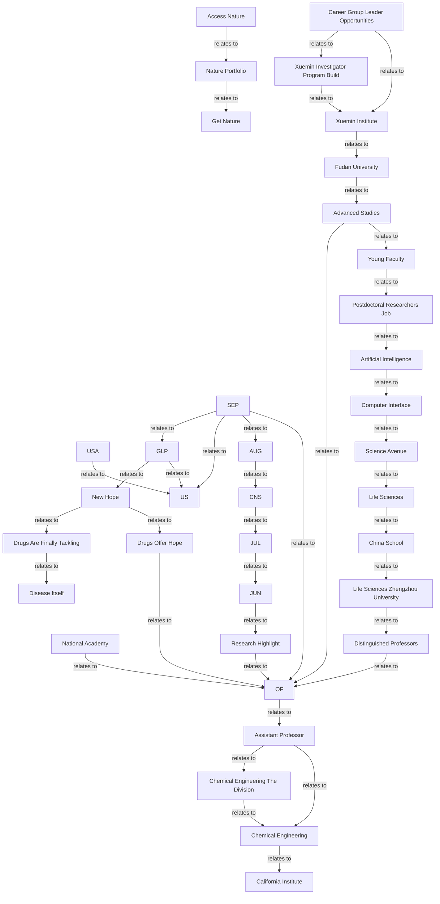

```mermaid
flowchart TD
    %% Knowledge Graph: Men’s brains shrink faster than women’s: what that means for Alzheimer’s | Nature
    %% Source: https://www.nature.com/articles/d41586-025-03353-5
    id_national_academy_7b0c3f["National Academy"] -- "relates to" --> id_of_8bf885["OF"]
    id_access_nature_eb999b["Access Nature"] -- "relates to" --> id_nature_portfolio_16016b["Nature Portfolio"]
    id_nature_portfolio_16016b["Nature Portfolio"] -- "relates to" --> id_get_nature_6dcc72["Get Nature"]
    id_usa_ada533["USA"] -- "relates to" --> id_us_0b3b97["US"]
    id_new_hope_3f5561["New Hope"] -- "relates to" --> id_drugs_are_finally_ta_7fcaec["Drugs Are Finally Tackling"]
    id_drugs_are_finally_ta_7fcaec["Drugs Are Finally Tackling"] -- "relates to" --> id_disease_itself_7f1938["Disease Itself"]
    id_sep_314e9e["SEP"] -- "relates to" --> id_glp_c0861a["GLP"]
    id_glp_c0861a["GLP"] -- "relates to" --> id_new_hope_3f5561["New Hope"]
    id_new_hope_3f5561["New Hope"] -- "relates to" --> id_drugs_offer_hope_a39c4c["Drugs Offer Hope"]
    id_drugs_offer_hope_a39c4c["Drugs Offer Hope"] -- "relates to" --> id_of_8bf885["OF"]
    id_glp_c0861a["GLP"] -- "relates to" --> id_us_0b3b97["US"]
    id_sep_314e9e["SEP"] -- "relates to" --> id_us_0b3b97["US"]
    id_sep_314e9e["SEP"] -- "relates to" --> id_aug_b7e538["AUG"]
    id_aug_b7e538["AUG"] -- "relates to" --> id_cns_3395f0["CNS"]
    id_cns_3395f0["CNS"] -- "relates to" --> id_jul_f05c86["JUL"]
    id_jul_f05c86["JUL"] -- "relates to" --> id_jun_6b5843["JUN"]
    id_jun_6b5843["JUN"] -- "relates to" --> id_research_highlight_545162["Research Highlight"]
    id_research_highlight_545162["Research Highlight"] -- "relates to" --> id_of_8bf885["OF"]
    id_career_group_leader__eebb00["Career Group Leader Opportunities"] -- "relates to" --> id_xuemin_investigator__24812e["Xuemin Investigator Program Build"]
    id_xuemin_investigator__24812e["Xuemin Investigator Program Build"] -- "relates to" --> id_xuemin_institute_da3aa9["Xuemin Institute"]
    id_xuemin_institute_da3aa9["Xuemin Institute"] -- "relates to" --> id_fudan_university_845650["Fudan University"]
    id_career_group_leader__eebb00["Career Group Leader Opportunities"] -- "relates to" --> id_xuemin_institute_da3aa9["Xuemin Institute"]
    id_fudan_university_845650["Fudan University"] -- "relates to" --> id_advanced_studies_9d68de["Advanced Studies"]
    id_advanced_studies_9d68de["Advanced Studies"] -- "relates to" --> id_of_8bf885["OF"]
    id_advanced_studies_9d68de["Advanced Studies"] -- "relates to" --> id_young_faculty_dadecf["Young Faculty"]
    id_young_faculty_dadecf["Young Faculty"] -- "relates to" --> id_postdoctoral_researc_c0bcb1["Postdoctoral Researchers Job"]
    id_postdoctoral_researc_c0bcb1["Postdoctoral Researchers Job"] -- "relates to" --> id_artificial_intellige_2dd069["Artificial Intelligence"]
    id_artificial_intellige_2dd069["Artificial Intelligence"] -- "relates to" --> id_computer_interface_acce78["Computer Interface"]
    id_computer_interface_acce78["Computer Interface"] -- "relates to" --> id_science_avenue_baa61c["Science Avenue"]
    id_science_avenue_baa61c["Science Avenue"] -- "relates to" --> id_life_sciences_af229f["Life Sciences"]
    id_life_sciences_af229f["Life Sciences"] -- "relates to" --> id_china_school_09d1cf["China School"]
    id_china_school_09d1cf["China School"] -- "relates to" --> id_life_sciences_zhengz_2822bb["Life Sciences Zhengzhou University"]
    id_life_sciences_zhengz_2822bb["Life Sciences Zhengzhou University"] -- "relates to" --> id_distinguished_profes_acdd62["Distinguished Professors"]
    id_distinguished_profes_acdd62["Distinguished Professors"] -- "relates to" --> id_of_8bf885["OF"]
    id_of_8bf885["OF"] -- "relates to" --> id_assistant_professor_4d21a0["Assistant Professor"]
    id_assistant_professor_4d21a0["Assistant Professor"] -- "relates to" --> id_chemical_engineering_c171de["Chemical Engineering The Division"]
    id_chemical_engineering_c171de["Chemical Engineering The Division"] -- "relates to" --> id_chemical_engineering_74f3fd["Chemical Engineering"]
    id_chemical_engineering_74f3fd["Chemical Engineering"] -- "relates to" --> id_california_institute_7e5745["California Institute"]
    id_assistant_professor_4d21a0["Assistant Professor"] -- "relates to" --> id_chemical_engineering_74f3fd["Chemical Engineering"]
    id_sep_314e9e["SEP"] -- "relates to" --> id_of_8bf885["OF"]
```