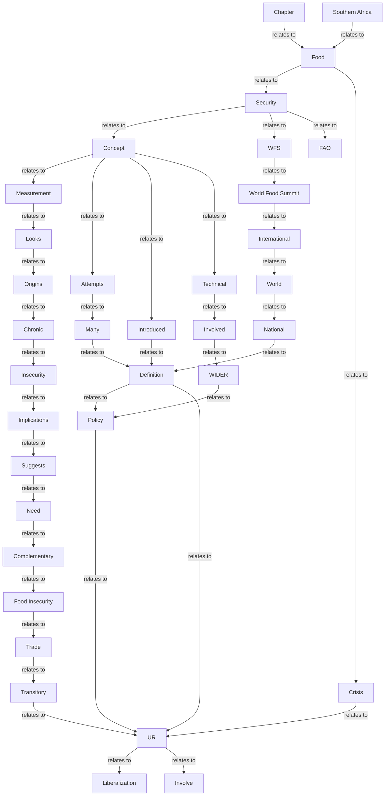

```mermaid
flowchart TD
    %% Knowledge Graph: Chapter 2. Food security: concepts and measurement[21]
    %% Source: https://www.fao.org/3/y4671e/y4671e06.htm
    id_chapter_7a3e56["Chapter"] -- "relates to" --> id_food_62506b["Food"]
    id_food_62506b["Food"] -- "relates to" --> id_security_e91e63["Security"]
    id_security_e91e63["Security"] -- "relates to" --> id_concept_47cb06["Concept"]
    id_concept_47cb06["Concept"] -- "relates to" --> id_measurement_df6485["Measurement"]
    id_measurement_df6485["Measurement"] -- "relates to" --> id_looks_4ab902["Looks"]
    id_looks_4ab902["Looks"] -- "relates to" --> id_origins_4d6228["Origins"]
    id_origins_4d6228["Origins"] -- "relates to" --> id_chronic_955fb3["Chronic"]
    id_chronic_955fb3["Chronic"] -- "relates to" --> id_insecurity_ac0ddf["Insecurity"]
    id_insecurity_ac0ddf["Insecurity"] -- "relates to" --> id_implications_9cd97f["Implications"]
    id_implications_9cd97f["Implications"] -- "relates to" --> id_suggests_e03f2a["Suggests"]
    id_suggests_e03f2a["Suggests"] -- "relates to" --> id_need_e877c5["Need"]
    id_need_e877c5["Need"] -- "relates to" --> id_complementary_907fac["Complementary"]
    id_complementary_907fac["Complementary"] -- "relates to" --> id_food_insecurity_aa878e["Food Insecurity"]
    id_food_insecurity_aa878e["Food Insecurity"] -- "relates to" --> id_trade_21e119["Trade"]
    id_trade_21e119["Trade"] -- "relates to" --> id_transitory_55afcf["Transitory"]
    id_transitory_55afcf["Transitory"] -- "relates to" --> id_ur_baceeb["UR"]
    id_ur_baceeb["UR"] -- "relates to" --> id_liberalization_769048["Liberalization"]
    id_southern_africa_d8ff85["Southern Africa"] -- "relates to" --> id_food_62506b["Food"]
    id_food_62506b["Food"] -- "relates to" --> id_crisis_931624["Crisis"]
    id_crisis_931624["Crisis"] -- "relates to" --> id_ur_baceeb["UR"]
    id_concept_47cb06["Concept"] -- "relates to" --> id_attempts_79845f["Attempts"]
    id_attempts_79845f["Attempts"] -- "relates to" --> id_many_8cd283["Many"]
    id_many_8cd283["Many"] -- "relates to" --> id_definition_30618b["Definition"]
    id_definition_30618b["Definition"] -- "relates to" --> id_policy_f4af8b["Policy"]
    id_policy_f4af8b["Policy"] -- "relates to" --> id_ur_baceeb["UR"]
    id_concept_47cb06["Concept"] -- "relates to" --> id_introduced_2c185e["Introduced"]
    id_introduced_2c185e["Introduced"] -- "relates to" --> id_definition_30618b["Definition"]
    id_concept_47cb06["Concept"] -- "relates to" --> id_technical_284018["Technical"]
    id_technical_284018["Technical"] -- "relates to" --> id_involved_860d7a["Involved"]
    id_involved_860d7a["Involved"] -- "relates to" --> id_wider_350b38["WIDER"]
    id_wider_350b38["WIDER"] -- "relates to" --> id_policy_f4af8b["Policy"]
    id_ur_baceeb["UR"] -- "relates to" --> id_involve_38b964["Involve"]
    id_security_e91e63["Security"] -- "relates to" --> id_wfs_e64541["WFS"]
    id_wfs_e64541["WFS"] -- "relates to" --> id_world_food_summit_93221d["World Food Summit"]
    id_world_food_summit_93221d["World Food Summit"] -- "relates to" --> id_international_15d700["International"]
    id_international_15d700["International"] -- "relates to" --> id_world_7d7930["World"]
    id_world_7d7930["World"] -- "relates to" --> id_national_f82d71["National"]
    id_national_f82d71["National"] -- "relates to" --> id_definition_30618b["Definition"]
    id_definition_30618b["Definition"] -- "relates to" --> id_ur_baceeb["UR"]
    id_security_e91e63["Security"] -- "relates to" --> id_fao_ae908e["FAO"]
```