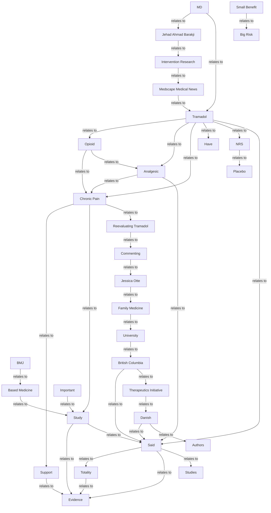

```mermaid
flowchart TD
    %% Knowledge Graph: Time to Reconsider Tramadol for Chronic Pain?
    %% Source: https://www.medscape.com/viewarticle/time-reconsider-tramadol-chronic-pain-2025a1000ria
    id_tramadol_1a920d["Tramadol"] -- "relates to" --> id_opioid_2e5151["Opioid"]
    id_opioid_2e5151["Opioid"] -- "relates to" --> id_chronic_pain_e9efc2["Chronic Pain"]
    id_md_793914["MD"] -- "relates to" --> id_jehad_ahmad_barakji_807446["Jehad Ahmad Barakji"]
    id_jehad_ahmad_barakji_807446["Jehad Ahmad Barakji"] -- "relates to" --> id_intervention_researc_031318["Intervention Research"]
    id_intervention_researc_031318["Intervention Research"] -- "relates to" --> id_medscape_medical_new_f7be2c["Medscape Medical News"]
    id_medscape_medical_new_f7be2c["Medscape Medical News"] -- "relates to" --> id_tramadol_1a920d["Tramadol"]
    id_tramadol_1a920d["Tramadol"] -- "relates to" --> id_analgesic_b74ce1["Analgesic"]
    id_analgesic_b74ce1["Analgesic"] -- "relates to" --> id_chronic_pain_e9efc2["Chronic Pain"]
    id_tramadol_1a920d["Tramadol"] -- "relates to" --> id_chronic_pain_e9efc2["Chronic Pain"]
    id_bmj_638485["BMJ"] -- "relates to" --> id_based_medicine_e4b21e["Based Medicine"]
    id_based_medicine_e4b21e["Based Medicine"] -- "relates to" --> id_study_2cd1c6["Study"]
    id_study_2cd1c6["Study"] -- "relates to" --> id_evidence_14e10d["Evidence"]
    id_opioid_2e5151["Opioid"] -- "relates to" --> id_analgesic_b74ce1["Analgesic"]
    id_tramadol_1a920d["Tramadol"] -- "relates to" --> id_have_b42dad["Have"]
    id_chronic_pain_e9efc2["Chronic Pain"] -- "relates to" --> id_support_434990["Support"]
    id_support_434990["Support"] -- "relates to" --> id_evidence_14e10d["Evidence"]
    id_small_benefit_e12b4e["Small Benefit"] -- "relates to" --> id_big_risk_cd26e7["Big Risk"]
    id_chronic_pain_e9efc2["Chronic Pain"] -- "relates to" --> id_study_2cd1c6["Study"]
    id_said_b7b791["Said"] -- "relates to" --> id_totality_2c65d5["Totality"]
    id_totality_2c65d5["Totality"] -- "relates to" --> id_evidence_14e10d["Evidence"]
    id_tramadol_1a920d["Tramadol"] -- "relates to" --> id_nrs_c8a42e["NRS"]
    id_nrs_c8a42e["NRS"] -- "relates to" --> id_placebo_6b6693["Placebo"]
    id_tramadol_1a920d["Tramadol"] -- "relates to" --> id_said_b7b791["Said"]
    id_md_793914["MD"] -- "relates to" --> id_tramadol_1a920d["Tramadol"]
    id_chronic_pain_e9efc2["Chronic Pain"] -- "relates to" --> id_reevaluating_tramado_ccfbbf["Reevaluating Tramadol"]
    id_reevaluating_tramado_ccfbbf["Reevaluating Tramadol"] -- "relates to" --> id_commenting_9cd8dd["Commenting"]
    id_commenting_9cd8dd["Commenting"] -- "relates to" --> id_jessica_otte_ffb926["Jessica Otte"]
    id_jessica_otte_ffb926["Jessica Otte"] -- "relates to" --> id_family_medicine_39ed38["Family Medicine"]
    id_family_medicine_39ed38["Family Medicine"] -- "relates to" --> id_university_10238d["University"]
    id_university_10238d["University"] -- "relates to" --> id_british_columbia_eebb8f["British Columbia"]
    id_british_columbia_eebb8f["British Columbia"] -- "relates to" --> id_said_b7b791["Said"]
    id_british_columbia_eebb8f["British Columbia"] -- "relates to" --> id_therapeutics_initiat_7f7965["Therapeutics Initiative"]
    id_therapeutics_initiat_7f7965["Therapeutics Initiative"] -- "relates to" --> id_danish_5b119a["Danish"]
    id_danish_5b119a["Danish"] -- "relates to" --> id_said_b7b791["Said"]
    id_analgesic_b74ce1["Analgesic"] -- "relates to" --> id_said_b7b791["Said"]
    id_said_b7b791["Said"] -- "relates to" --> id_evidence_14e10d["Evidence"]
    id_important_48818f["Important"] -- "relates to" --> id_study_2cd1c6["Study"]
    id_study_2cd1c6["Study"] -- "relates to" --> id_said_b7b791["Said"]
    id_danish_5b119a["Danish"] -- "relates to" --> id_authors_5d9449["Authors"]
    id_said_b7b791["Said"] -- "relates to" --> id_studies_a086c3["Studies"]
```