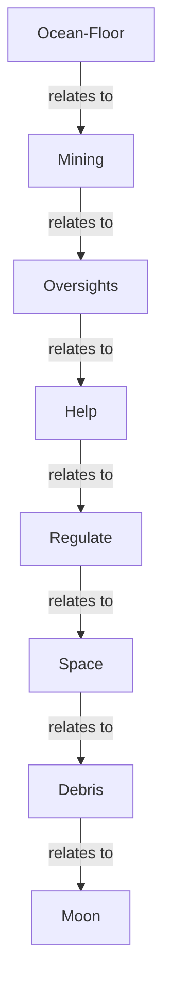

```mermaid
flowchart TD
    %% Knowledge Graph: Circle versus rectangle: finding ‘Earth 2.0’ may be easier using a new telescope shape
    %% Source: https://www.frontiersin.org/news/2025/09/01/rectangle-telescope-finding-habitable-planets
    id_ocean_floor_83f619["Ocean-Floor"] -- "relates to" --> id_mining_e1c0a6["Mining"]
    id_mining_e1c0a6["Mining"] -- "relates to" --> id_oversights_e777d1["Oversights"]
    id_oversights_e777d1["Oversights"] -- "relates to" --> id_help_657f8b["Help"]
    id_help_657f8b["Help"] -- "relates to" --> id_regulate_15d3db["Regulate"]
    id_regulate_15d3db["Regulate"] -- "relates to" --> id_space_ff2364["Space"]
    id_space_ff2364["Space"] -- "relates to" --> id_debris_2df9af["Debris"]
    id_debris_2df9af["Debris"] -- "relates to" --> id_moon_6d4db5["Moon"]
```