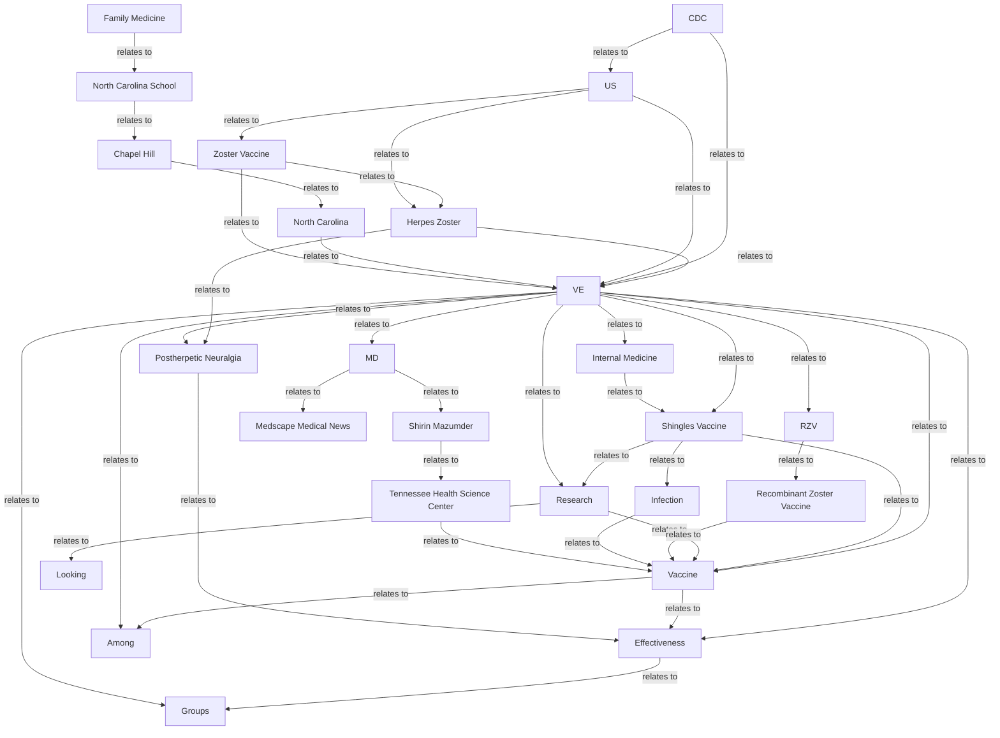

```mermaid
flowchart TD
    %% Knowledge Graph: Second Dose Boosts Shingles Protection in Adults Over 65
    %% Source: https://www.medscape.com/viewarticle/second-dose-boosts-shingles-protection-adults-aged-65-years-2025a1000ro7
    id_us_0b3b97["US"] -- "relates to" --> id_zoster_vaccine_06228c["Zoster Vaccine"]
    id_zoster_vaccine_06228c["Zoster Vaccine"] -- "relates to" --> id_herpes_zoster_843cfa["Herpes Zoster"]
    id_herpes_zoster_843cfa["Herpes Zoster"] -- "relates to" --> id_ve_eabb18["VE"]
    id_ve_eabb18["VE"] -- "relates to" --> id_vaccine_d4aac1["Vaccine"]
    id_ve_eabb18["VE"] -- "relates to" --> id_effectiveness_eb7a99["Effectiveness"]
    id_cdc_8ae114["CDC"] -- "relates to" --> id_ve_eabb18["VE"]
    id_cdc_8ae114["CDC"] -- "relates to" --> id_us_0b3b97["US"]
    id_us_0b3b97["US"] -- "relates to" --> id_ve_eabb18["VE"]
    id_family_medicine_39ed38["Family Medicine"] -- "relates to" --> id_north_carolina_schoo_5709c1["North Carolina School"]
    id_north_carolina_schoo_5709c1["North Carolina School"] -- "relates to" --> id_chapel_hill_37ee91["Chapel Hill"]
    id_chapel_hill_37ee91["Chapel Hill"] -- "relates to" --> id_north_carolina_06da23["North Carolina"]
    id_north_carolina_06da23["North Carolina"] -- "relates to" --> id_ve_eabb18["VE"]
    id_ve_eabb18["VE"] -- "relates to" --> id_shingles_vaccine_ea12ef["Shingles Vaccine"]
    id_shingles_vaccine_ea12ef["Shingles Vaccine"] -- "relates to" --> id_vaccine_d4aac1["Vaccine"]
    id_vaccine_d4aac1["Vaccine"] -- "relates to" --> id_effectiveness_eb7a99["Effectiveness"]
    id_ve_eabb18["VE"] -- "relates to" --> id_internal_medicine_6aca9b["Internal Medicine"]
    id_internal_medicine_6aca9b["Internal Medicine"] -- "relates to" --> id_shingles_vaccine_ea12ef["Shingles Vaccine"]
    id_shingles_vaccine_ea12ef["Shingles Vaccine"] -- "relates to" --> id_research_7412df["Research"]
    id_research_7412df["Research"] -- "relates to" --> id_vaccine_d4aac1["Vaccine"]
    id_us_0b3b97["US"] -- "relates to" --> id_herpes_zoster_843cfa["Herpes Zoster"]
    id_herpes_zoster_843cfa["Herpes Zoster"] -- "relates to" --> id_postherpetic_neuralg_cae9d4["Postherpetic Neuralgia"]
    id_effectiveness_eb7a99["Effectiveness"] -- "relates to" --> id_groups_1471e4["Groups"]
    id_zoster_vaccine_06228c["Zoster Vaccine"] -- "relates to" --> id_ve_eabb18["VE"]
    id_vaccine_d4aac1["Vaccine"] -- "relates to" --> id_among_3172db["Among"]
    id_ve_eabb18["VE"] -- "relates to" --> id_rzv_00a2f2["RZV"]
    id_rzv_00a2f2["RZV"] -- "relates to" --> id_recombinant_zoster_v_61a3cb["Recombinant Zoster Vaccine"]
    id_recombinant_zoster_v_61a3cb["Recombinant Zoster Vaccine"] -- "relates to" --> id_vaccine_d4aac1["Vaccine"]
    id_ve_eabb18["VE"] -- "relates to" --> id_postherpetic_neuralg_cae9d4["Postherpetic Neuralgia"]
    id_postherpetic_neuralg_cae9d4["Postherpetic Neuralgia"] -- "relates to" --> id_effectiveness_eb7a99["Effectiveness"]
    id_ve_eabb18["VE"] -- "relates to" --> id_groups_1471e4["Groups"]
    id_ve_eabb18["VE"] -- "relates to" --> id_among_3172db["Among"]
    id_shingles_vaccine_ea12ef["Shingles Vaccine"] -- "relates to" --> id_infection_75a412["Infection"]
    id_infection_75a412["Infection"] -- "relates to" --> id_vaccine_d4aac1["Vaccine"]
    id_ve_eabb18["VE"] -- "relates to" --> id_md_793914["MD"]
    id_md_793914["MD"] -- "relates to" --> id_shirin_mazumder_77fa1f["Shirin Mazumder"]
    id_shirin_mazumder_77fa1f["Shirin Mazumder"] -- "relates to" --> id_tennessee_health_sci_bb7573["Tennessee Health Science Center"]
    id_tennessee_health_sci_bb7573["Tennessee Health Science Center"] -- "relates to" --> id_vaccine_d4aac1["Vaccine"]
    id_md_793914["MD"] -- "relates to" --> id_medscape_medical_new_f7be2c["Medscape Medical News"]
    id_ve_eabb18["VE"] -- "relates to" --> id_research_7412df["Research"]
    id_research_7412df["Research"] -- "relates to" --> id_looking_f8905f["Looking"]
```